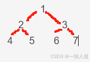

a. 表述什么是双向链表，什么是满二叉树  
b. 先让写一个双向的链表   
c. 然后链表修改成完全二叉树并增加泛型值属性和父节点，入参是一个int 表示二叉树层级  
d. 在创建二叉树的原有方法上修改，将按照规则填充 ,类型为int，填充顺序见下图（图2-1）  

1、递归遍历指定节点的子节点   
2、递归遍历节点的父节点，遍历父节点的时候还会再遍历父节点的子节点，这个时候，通过判断子节点是否为已经
遍历过的子节点来决定是否跳过（通过参数记录上次遍历的子节点引用来判断）

a、将value值改为 char类型，使用 A-Z 填充
b、将3个满二叉树的跟节点循环指向；然后根据指定的任意节点开始遍历，
  要求不重复遍历任何节点，不使用集合，不另开劈空间， 不能改节点结构 

冒泡排序  
二分查找（需要的是一个已经排好序的数组）

